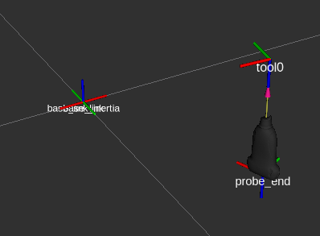
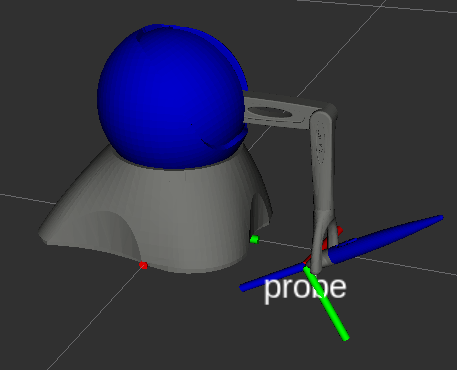

# Learning OpenHaptics for Geomagic Touch

## 1. QuickHaptics micro API

## 2. Haptic Device (HDAPI)

## 3. Haptic Library (HLAPI)

## 4. Geomagic Touch

### 4.1 Coordinate Transform

**Joint Value**

The base frame defined by the Touch is shown below, the origin of this frame is not sure.

The URDF file defined by above repository assigns a new frame for this robot as is shown below. Also there are some modifications to adapt this model to real Geomagic Touch. 

1. Joint 1 should be **negative** to the sensor measurement. [-0.98, 0.98]
2. Joint 2 is correct. [0 1.75]
3. Real Joint 3 value equals to measurement of J3 **minus** measurement of J2 from HDAPI. Also we restrict the range to [-0.81, 1.25]. Note that the real touch has some hardware restrictions of Joint3, which means when J2 choose to be 1.75 rad, J3 can not reach 1.25 as expected. That may affect the real workspace of Touch. Furthermore, some collision will occurs too. [-0.81 1.2]
4. Joint 4 should be **negative** to the sensor measurement. [-2.5 2.5]
5. Joint 5 is correct in direction. we change the initial state of Joint 5, and then project it into encoder range. so the sensor measurement should be **add 1.49**. [0, 2.4]
6. Joint 6 is correct. [-2.58 2.58] 

**Position:**

the end effector's position is verified by the computed transformation (TF) and the HDAPI's GetPosition function. There exists some bias because the origin of frame assigned by HDAPI is not sure. It is just a approximation.

- Add **base_ref** frame in URDF file. 

**Orientation:**

similarly we assign **stylus_ref** frame in URDF to represent the frame in API's view.

### 4.2 Teleoperation

- **Position to Position** 

**base_link**->**base_link_inertial**->......->**tool0**->**probe_end**

master Joint values -> Cartesian position -> filter -> slave position 

- **Position to Velocity**

