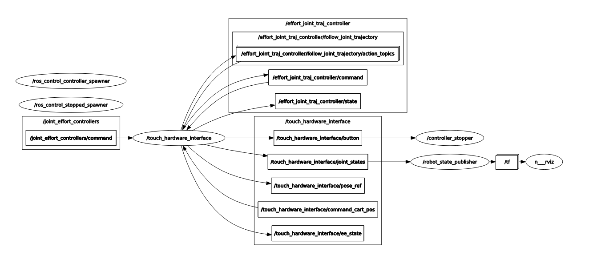

# touch_driver

Here is the ROS driver package for **3D Systems Touch**.

___

- [1. Overview](#1-overview)

- [2. Class](#2-class)

  - [2.1. GeomagicProxy](#21-geomagicproxy)

    - [2.1.1 Frames](#211-frames)

    - [2.1.2 Cartesian Pose](#212-cartesian-pose)
    - [2.1.5 TODO](#215-todo)

  - [2.2 kinematic_chain_base](#22-kinematic_chain_base)

  - [2.3 kinematic_chain_solver](#23-kinematic_chain_solver)

  - [2.4 hardware_interface](#24-hardware_interface)

  - [2.5 controller_stopper](#25-controller_stopper)

- [3. Problem](#3-problem)

## 1. Overview

## 2. Class

### 2.1 GeomagicProxy

It mainly integrates some **HD** apis to obtain status of Touch device. 

#### 2.1.1 Frames

The direction of base frame defined by the Touch is shown below, while the origin of this frame is not sure. The author assigns a `base_ref` frame in urdf to approximate it. Similarly, `stylus_ref` is the approximate end effector frame.

However, we define a series of frames in urdf which would be a little bit different. So, we need to do some operations for the raw joint value readings to adapt our urdf joint.

|  Joint  |  Operation  |
| :--: | :--: |
| **joint1_waist** | `joint[0] = -raw[0]` |
| **joint2_shoulder** | `joint[1] = raw[1]` |
| **joint3_elbow** | `joint[2] = raw[2]-raw[1]` |
| **joint4_yaw** | `joint[3] = -raw[3]` |
| **joint5_pitch** | `joint[4] = raw[4]+1.49` |
| **joint6_roll** | `joint[5] = raw[5]` |

> Note that **joint3_elbow** is physically correlated to **joint2_shoulder**. when **joint2_shoulder** is large, there is a restriction on **joint3_elbow**

#### 2.1.2 Cartesian Pose 

Actually the author intends to use pose data which is handy to read by HD API, to do the teleoperation and active control work. 

#### 2.1.5 TODO

1. **transform** the raw pose data to desired transformation from `root_name` to `tip_name`. Now the position vector only changes the direction and still has a bias term. And the orientation vector do none changes. The velocity term is not right, either.
2. **Jacobian matrix** has not been verified. I see a large term. May be due to the mm to m?
3. **Important** to get the running status of Touch device. Like inwell status? 

### 2.2 kinematic_chain_base

kinematic_chain_base provide basic kdl parser functions. It needs `robot_description`, `root_name`, `tip_name` as input parameters to start parse joints and links from URDF.

### 2.3 kinematic_chain_solver

kinematic_chain_solver mainly includes forward kinematic solver and inverse kinematic solver based on KDL and TRAC-IK, respectively. 

### 2.4 hardware_interface

**HardwareInterface** handles the interface between the ROS system (**Controller/Controller Manager**) and the real touch driver **GeomagicProxy**. It contains the read and write methods of the main control loop and registers various ROS topics and services.

#### 2.4.2 TODO

1. TODO:

### 2.5 controller_stopper

**controller stoppper** is used for switch controller via controller manager service according to the button states. Because the author failed to call service in the read/write main loop.

## 3. Problem

1. when the author apply `joint_effort_controllers` to cartesian position interface, it will cause large tremble. when th author do joint effort control, it works fine. (Solved)
1. based on the above problem, the author intends to realize `cartesian force controller` with `EffortJointInterface` when solving inverse kinematic problem for every joint. One method is to apply moveit to solver the ik problem and plan trajectory for me. But the `touch_moveit_config` failed to solve. So then the author plan to solve ik by myself using KDL or TRAC-IK. It turns out that TRAC-IK works better than KDL. (Solved)
